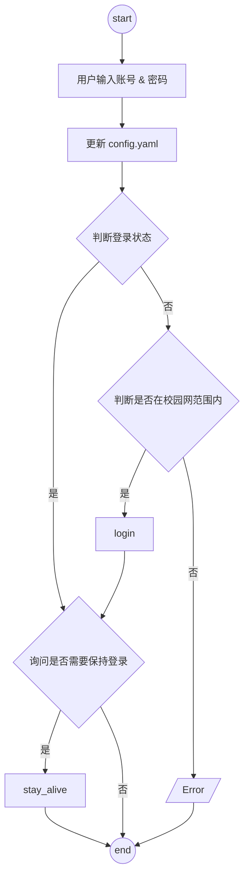

# cuit-campus-network


[](https://www.python.org)
[](https://github.com/Chaoermeng/cuit-campus-network/main/LICENSE)
[](https://github.com/Chaoermeng/cuit-campus-network/commits)

[](https://github.com/Chaoermeng/cuit-campus-network)
[](https://github.com/Chaoermeng/cuit-campus-network)

简体中文 | [English](<https://github.com/Chaoermeng/cuit-campus-network/blob/main/README_EN.md>)

## 简介

>[成都信息工程大学](<https://www.cuit.edu.cn>)校园网自动登录&保持登录脚本（`Python` 实现）  
>该脚本包含两个部分：[登入](#登入)和[保持登入状态](#保持登入状态)  
>当前版本仅在宿舍可用。教学楼&图书馆&实验室似乎采用了不同的认证机制，需要进一步抓包分析

## 计划

- [x] :chart_with_upwards_trend: 增加图例
- [x] :pencil2: 增加流程图（使用 `Mermaid`）
- [x] :iphone: 编写 `iOS` 快捷指令
- [ ] :rocket: 增加对移动的支持
- [ ] :school: 增加对教学楼&图书馆&实验室的支持
- [ ] :eyes: 配置可视化界面（`Node.js` 或 `Gradio`）
- [ ] :hammer: 使用 `Pyinstaller` 打包为可执行程序
- [ ] :file_folder: 打包为 `Docker` 容器

## 登入

### Windows/MacOS/Linux

1. 配置环境（使用 `pyenv`）

    ``` Shell

    # 配置虚拟环境（可选）
    python3 -m venv .venv
    source .venv/bin/activate

    # 安装依赖
    pip install requests pyyaml

    ```

2. 运行 `main.py`
3. （可选）[保持登入状态](#保持登入状态)

### iOS

[](<https://www.icloud.com/shortcuts/c959666847664269acebcfc9eea2a1b2>)

## 原理

通过抓包发现，校园网认证的过程中，客户端会向服务器发送一个 `POST` 请求。因此，我们可以通过 `Python` 中的 `requests` 库来模拟浏览器行为，向服务器发送这两个数据包，从而实现自动登录

## 流程



## 抓包步骤

1. 退出登录
2. 在输入校园网账号密码后在键盘上点击`f12`（或右键网页 -> 检查），找到网络选项
3. 点击认证
4. 找到 `sucess.jsp` 开头的文件以及 `InterFace.do` 开头的文件。根据前者的 `Payload` 内容修改 `payload_config.py` 文件，根据后者的“标头”内容修改 `headers_config` 文件
5. 根据你的客户端配置环境，需要安装 `requests` 库。如果执行 `login.py` 文件后输出“认证成功”，则表示成功配置

## 保持登入状态

### 方法一

通过一个死循环，不断检测校园网是否连接。如果未连接，则执行登录脚本。

- 优点：稳定
- 缺点：后台需始终运行该程序，占用些微系统资源；用于执行程序的主机不能关机

### 方法二

由于校园网登录有时效性（约为 48 小时不到），可以通过在固定时间执行登出脚本后马上执行登录脚本，从而刷新已登录时间。

- 优点：不需要保持开机，只需要在特定时间运行即可
- 缺点：不如方法一稳定

## 实现

### 通用

直接运行 `main.py` 或者 `stay_alive.py.py` 脚本会实现自动登录

### Windows

可以通过[计划任务程序](<https://learn.microsoft.com/zh-cn/windows/win32/taskschd/using-the-task-scheduler>)实现


### MacOS

如果你不想让 `Python` 程序在后台常驻，可以通过编辑 [plist](https://support.apple.com/zh-cn/guide/terminal/apda49a1bb2-577e-4721-8f25-ffc0836f6997/mac) 文件实现

1.路径

`~/Library/LaunchAgents/com.campusnetwork.auto.plist`

2.编辑

>**注意需要根据实际情况修改为你的脚本路径**

```shell
<?xml version="1.0" encoding="UTF-8"?>
<!DOCTYPE plist PUBLIC "-//Apple//DTD PLIST 1.0//EN" "http://www.apple.com/DTDs/PropertyList-1.0.dtd">
<plist version="1.0">
<dict>
    <!-- 唯一标识符 -->
    <key>Label</key>
    <string>com.campusnetwork.auto</string>

    <!-- 任务运行的命令和参数 -->
    <key>ProgramArguments</key>
    <array>
        <string>/bin/bash</string>
        <string>-c</string>
        <string>
        /Users/chao/Documents/Scripts/Campus_Network/.venv/bin/python /Users/chao/Documents/Scripts/Campus_Network/logout.py &&
        /Users/chao/Documents/Scripts/Campus_Network/.venv/bin/python /Users/chao/Documents/Scripts/Campus_Network/login.py
        </string>
    </array>

    <!-- 定时触发时间 -->
    <key>StartCalendarInterval</key>
    <dict>
        <key>Hour</key>
        <integer>5</integer>
        <key>Minute</key>
        <integer>0</integer>
    </dict>

    <!-- 任务运行环境 -->
    <key>EnvironmentVariables</key>
    <dict>
        <key>PATH</key>
        <string>/usr/local/bin:/usr/bin:/bin:/usr/sbin:/sbin</string>
    </dict>

    <!-- 日志路径 -->
    <key>StandardOutPath</key>
    <string>/Users/chao/Documents/Scripts/Campus_Network/campusnetwork.log</string>
    <key>StandardErrorPath</key>
    <string>/Users/chao/Documents/Scripts/Campus_Network/campusnetwork_error.log</string>
</dict>
</plist>
```

3.加载任务

```Shell
launchctl load ~/Library/LaunchAgents/com.campusnetwork.auto.plist
```

4.卸载任务（可选）

```Shell
launchctl unload ~/Library/LaunchAgents/com.campusnetwork.auto.plist
```

## LICENSE

[MIT LICENSE](<https://github.com/Chaoermeng/cuit-campus-network/blob/main/LICENSE>)
