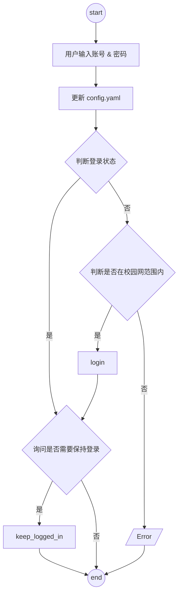

# cuit-campus-network


[](https://www.python.org)
[](https://github.com/Chaoermeng/cuit-campus-network/main/LICENSE)
[](https://github.com/Chaoermeng/cuit-campus-network/commits)
[](https://github.com/Chaoermeng/cuit-campus-network)
[](https://github.com/Chaoermeng/cuit-campus-network)

简体中文 | [English](<https://github.com/Chaoermeng/cuit-campus-network/blob/main/README_EN.md>)

## 简介

>锐捷校园网登录&注销&保持登录脚本（`Python` 和 `Shell` 实现）  
>该脚本包含两个部分：[登录&注销&获取登录状态](#登录注销)和[保持登录状态](#保持登录状态)  

## 计划

- [x] :chart_with_upwards_trend: 增加图例
- [x] :pencil2: 增加流程图（使用 `Mermaid`）
- [x] :iphone: 编写 `iOS` 快捷指令
- [x] :rocket: 增加对移动的支持
- [x] :school: 增加对教学楼&图书馆&实验室的支持
- [ ] :eyes: 配置可视化界面（`Next.js` 或 `Gradio`）
- [ ] :hammer: 使用 `Pyinstaller` 打包为可执行程序
- [ ] :file_folder: 打包为 `Docker` 容器

## 使用

### 登录&注销

#### Windows

1. PowerShell
   1. 克隆本仓库
   2. 打开 `命令提示符`
   3. 运行脚本

        ```pwsh
        # 根据实际情况切换到项目目录
        cd ./cnc/powershell

        # 运行脚本
        pwsh -ExecutionPolicy Bypass -File .\bin\login.ps1
        ```

2. Python
   1. 配置环境（使用 `venv`）

        ``` shell

        # 配置虚拟环境
        python -m venv .venv
        .venv\Scripts\activate.bat  # cmd
        .venv\Scripts\Activate.ps1  # pwsh

        # 安装依赖
        pip install requests
        ```

   2. 运行 `main.py`
   3. （可选）[保持登录状态](#on-windows)

### macOS & GNU/Linux

1. shell
   1. 克隆本仓库
   2. 打开`终端`
   3. 运行脚本

        ```shell
        cd CUIT-Campus-Network
        chmod +x /bin/shell/login.sh
        ./bin/shell/login.sh
        ```

2. Python
   1. 配置环境（推荐使用 [uv](<https://docs.astral.sh/uv/>), 也可以使用 `venv`。以下演示 uv）

        ```shell
        uv init
        uv pip install requests
        ```

   2. 运行 `main.py`

        ```shell
        uv run /bin/shell/login.sh
        ```

   3. （可选）[保持登录状态](#on-macos)

### iOS

[](<https://www.icloud.com/shortcuts/c959666847664269acebcfc9eea2a1b2>)

## 流程



## 抓包

> 非必须，如果你也感兴趣，可以参考以下步骤。如果遇到问题，欢迎提交 [issue](<https://github.com/Chaoermeng/CUIT-Campus-Network/issues>)！

1. 退出登录
2. 在输入校园网账号密码后在键盘上点击`f12`（或右键网页 -> 检查），找到网络选项。**记得勾选“保留日志”！**
3. 点击认证
4. 找到 `InterFace.do?method=login` 开头的数据包。可以看到，载荷（`Payload`）中包含了你的账号、密码和服务提供商（服务提供商不是汉字, 因为被 url 编码了）
5. 找到 `http://123.123.123.123`, 其返回值是 `JavaScript`。被 `<script>` 标签包裹的就是 `queryString`。其值主要用来验证用户源 ip 以及设备注册信息
6. 用 curl 模仿发送 `InterFace.do?method=login` 数据包，方法为 `POST`。其中需包含的字段有：

    ```shell
    # Header
    -H 'Content-Type: application/x-www-form-urlencoded; charset=UTF-8' \

    # Body
    # 用户信息
    --data-urlencode "userId=$userId" \
    --data-urlencode "password=$password" \
    --data-urlencode "service=$service" \
    --data-urlencode "queryString=$queryString" \
    # 占位字段
    --data-urlencode 'operatorPwd=' \
    --data-urlencode 'operatorUserId=' \
    --data-urlencode 'validcode=' \
    --data-urlencode 'passwordEncrypt=false'
    ```

## 保持登录状态

### 方法一

通过一个死循环，不断检测校园网是否连接。如果未连接，则执行登录脚本。

- 优点：稳定
- 缺点：后台需始终运行该程序，占用些微系统资源；用于执行程序的主机不能关机

### 方法二

由于校园网登录有时效性（约为 48 小时不到），可以通过在固定时间执行登出脚本后马上执行登录脚本，从而刷新已登录时间。

- 优点：不需要保持开机，只需要在特定时间运行即可
- 缺点：不如方法一稳定

## 实现

### 通用

直接运行 `main.py` 或者 `keep_logged_in.py` 脚本会实现自动登录

### on Windows

- 通过[计划任务程序](<https://learn.microsoft.com/zh-cn/windows/win32/taskschd/using-the-task-scheduler>)的 GUI 实现
  

- 通过 `schtasks.exe` 的 CLI 实现  
- 通过 `PowerShell ScheduledJob` 实现

### on macOS

> 通过 `launchd` 实现。

如果你不想让 `Python` 程序在后台常驻，可以通过编辑 [plist](https://support.apple.com/zh-cn/guide/terminal/apda49a1bb2-577e-4721-8f25-ffc0836f6997/mac) 文件实现

1.路径

```shell
~/Library/LaunchAgents/com.campusnetwork.auto.plist
```

2.编辑

>**注意需要修改脚本路径为实际路径**

```xml
<?xml version="1.0" encoding="UTF-8"?>
<!DOCTYPE plist PUBLIC "-//Apple//DTD PLIST 1.0//EN" "http://www.apple.com/DTDs/PropertyList-1.0.dtd">
<plist version="1.0">
<dict>
    <!-- 唯一标识符 -->
    <key>Label</key>
    <string>com.campusnetwork.auto</string>

    <!-- 任务运行的命令和参数 -->
    <key>ProgramArguments</key>
    <array>
        <string>/bin/bash</string>
        <string>-c</string>
        <string>
        /Users/chao/Documents/Scripts/Campus_Network/.venv/bin/python /Users/chao/Documents/Scripts/Campus_Network/logout.py &&
        /Users/chao/Documents/Scripts/Campus_Network/.venv/bin/python /Users/chao/Documents/Scripts/Campus_Network/login.py
        </string>
    </array>

    <!-- 定时触发时间 -->
    <key>StartCalendarInterval</key>
    <dict>
        <key>Hour</key>
        <integer>5</integer>
        <key>Minute</key>
        <integer>0</integer>
    </dict>

    <!-- 任务运行环境 -->
    <key>EnvironmentVariables</key>
    <dict>
        <key>PATH</key>
        <string>/usr/local/bin:/usr/bin:/bin:/usr/sbin:/sbin</string>
    </dict>

    <!-- 日志路径 -->
    <key>StandardOutPath</key>
    <string>/Users/chao/Documents/Scripts/Campus_Network/campusnetwork.log</string>
    <key>StandardErrorPath</key>
    <string>/Users/chao/Documents/Scripts/Campus_Network/campusnetwork_error.log</string>
</dict>
</plist>
```

3.加载任务

```shell
launchctl load ~/Library/LaunchAgents/com.campusnetwork.auto.plist
```

4.（可选）卸载任务

```shell
launchctl unload ~/Library/LaunchAgents/com.campusnetwork.auto.plist
```

### on Linux

> 通过 `systemd` 实现。

1. （可选）创建环境变量

    |变量名|含义|
    |:-:|:-:|
    |CUIT_USERID|校园网账号|
    |CUIT_PASSWORD|校园网密码|
    |CUIT_SERVICE|运营商|

2. 建立系统级 `service`（将本项目 `systemd` 文件夹下的 `service` 和 `timer` 文件移动至 `/etc/systemd/system` 文件夹下。**注意将脚本路径修改为实际路径**）。也可建立用户级 `service`，需要额外配置 `linger` 或者 `gdm` 自动登录

    ```shell
    sudo mv ./systemd/* /etc/systemd/system
    ```

3. 启动服务

    ```shell
    sudo systemctl daemon-reload
    sudo systemctl enable --now /etc/systemd/system/keep_logged_in.timer
    ```

## LICENSE

[MIT LICENSE](<https://github.com/Chaoermeng/cuit-campus-network/blob/main/LICENSE>)
