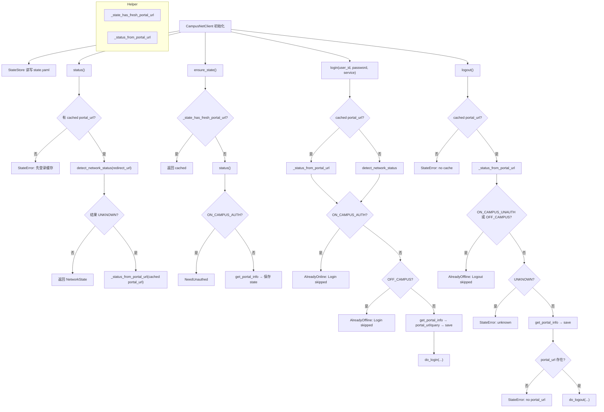

# cuit-campus-network


[](https://www.python.org)
[](https://github.com/ermengchao/cnc/main/LICENSE)
[](https://github.com/ermengchao/cnc/commits)
[](https://github.com/ermengchao/cnc)
[](https://github.com/ermengchao/cnc)

简体中文 | [English](<https://github.com/ermengchao/cnc/blob/main/README.md>)

## 简介

> `cnc` 是一个第三方校园网客户端，适用于使用锐捷作为校园网服务商的学校。作为一个 `Python` 脚本，`cnc` 可以方便的安装，并让你能够通过 cli 界面实现包括但不限于登陆、登出、查看状态、保持登陆等操作

## 计划

- [x] :chart_with_upwards_trend: 增加图例
- [x] :pencil2: 增加流程图（使用 `Mermaid`）
- [x] :iphone: 编写 `iOS` 快捷指令
- [x] :rocket: 增加对移动的支持
- [x] :school: 增加对教学楼&图书馆&实验室的支持
- [ ] :eyes: 配置可视化界面（`Next.js` 或 `Gradio`）
- [ ] :hammer: 上传至 `PyPI`
- [ ] :beer: 上传至 `Homebrew`
- [ ] :file_folder: 打包为 `Docker` 容器

## 安装

- Pip
```shell
pip install cnc-cli
```

- Source Code
  1. 克隆本仓库

  ```shell
  git clone https://github.com/ermengchao/cnc . && cd cnc
  ```

  2. 安装 `cnc` 包

  ```shell
  pip install -e .
  ```

## 使用

:exclamation::exclamation: 在使用前，请首先运行

```python
cnc login
```

以创建缓存。缓存内容如下：

```yaml
portal_url: http://10.254.241.19
updated_at: 1766905991
```

- portal_url: 认证的门户网站。每个学校不同
- updated_at: 缓存创建时间

如果缓存没有正常创建，除了 `login` 以外的操作可能会受到限制

当缓存创建后，可以正常使用 `cnc`。支持的操作有：

- [login](#login): 登陆校园网
- [logout](#logout): 登出校园网
- [status](#status): 查看校园网连接状态
- [keep-alive](#keep-alive): 通过持久化脚本保持登陆。推荐配合 `systemd` 实现
- [help](#help): 查看使用说明

### login

使用：

```shell
cnc login --user-id 2023083061 --password ****** --service 电信
```

输入：

- `user-id`: 校园网账号。也可通过环境变量 `CNC_USER_ID` 设定
- `password`: 校园网密码。也可通过环境变量 `CNC_PASSWORD` 设定
- `service`: ISP。也可通过环境变量 `CNC_SERVICE` 设定

输出：

- `Login successful`: 登陆成功
- `Already online. Login skipped.`: 当前已在线，没有执行登陆操作
- `You appear to be offline. Login skipped.`: 未接入校园网
- `Login failed: <具体错误>`: 登陆失败。具体错误由服务器返回的信息给出
- `State is missing/expired but you appear to be already authenticated...`: 缺少缓存

### logout

使用：

```shell
cnc logout
```

输入：

- 无（使用本地缓存的 `portal_url`）

输出：

- `Logged out successfully`: 登出成功
- `Already offline. Logout skipped.`: 当前已离线，没有执行登出操作
- `Logout failed: <具体错误>`: 登出失败。具体错误由服务器返回的信息给出
- `No cached portal_url found. Please run `cnc login` once to initialize the cache before using other commands.`: 缺少缓存

### status

使用：

```shell
cnc status
```

输入：

- 无（使用本地缓存的 `portal_url`）

输出：

- `Status: on_campus_unauth`: 已接入校园网但未认证
- `Status: on_campus_auth`: 已接入并完成认证
- `Status: off_campus`: 未接入校园网
- `Status: unknown`: 状态未知
- `No cached portal_url found. Please run `cnc login` once to initialize the cache before using other commands.`: 缺少缓存

### keep-alive

使用（轮询模式，默认）：

```shell
cnc keep-alive --polling --interval-seconds 300
```

使用（定时重登模式）：

```shell
cnc keep-alive --relogin --user-id 2023083061 --password ****** --service 电信 --run-at 05:00
```

输入：

- `--polling` 或 `--relogin`（二选一）
- `--interval-seconds`: 轮询间隔秒数（仅轮询模式，默认 `300`）
- `--user-id`、`--password`、`--service`: 仅定时重登模式需要（也可用 `CNC_USER_ID`、`CNC_PASSWORD`、`CNC_SERVICE`）
- `--run-at`: 定时重登时间（仅定时重登模式，`HH:MM`，默认 `05:00`）

输出：

- `Choose only one mode: --polling or --relogin`: 模式冲突
- `relogin mode requires --user-id, --password, and --service`: 定时重登缺少参数
- `Keep-alive failed: <具体错误>`: 保持登录失败
- `No cached portal_url found. Please run `cnc login` once to initialize the cache before using other commands.`: 缺少缓存

### help

使用：

```shell
cnc help
cnc help login
```

输入：

- 可选子命令名称

输出：

- 打印命令行帮助信息

## 流程图



## 原理

> 非必须。如果你也感兴趣，可以参考以下步骤。如果遇到问题，欢迎提交 [issue](<https://github.com/ermengchao/cnc/issues>)！

### 登陆原理

登陆本质上是向 `http://{portal_url}/eportal/Interface.do?method=login` 发送一个 `POST` 请求。其中需包含的字段有：

    ```shell
    # Header
    -H 'Content-Type: application/x-www-form-urlencoded; charset=UTF-8' \

    # Body
    # 用户信息
    --data-urlencode "userId=$userId" \
    --data-urlencode "password=$password" \
    --data-urlencode "service=$service" \
    --data-urlencode "queryString=$queryString" \
    # 占位字段
    --data-urlencode 'operatorPwd=' \
    --data-urlencode 'operatorUserId=' \
    --data-urlencode 'validcode=' \
    --data-urlencode 'passwordEncrypt=false'
    ```

### 登出原理

登出本质上是向 `http://{pottal_url}/eportal/Interface.do?method=logout` 发送一个 `POST` 请求。不像登陆，登出操作无需任何请求体

### 状态原理

获取状态本质上是向 `http://{portal_url}/eportal/redirectortosuccess.jsp` 发送一个 `Get` 请求，分析响应头中的 `Location` 字段即可：

- 已登陆：Location=`http://{pottal_url}/eportal/./success.jsp`
- 未登陆：Location=`http://123.123.123.123/`
- 未接入校园网：请求超时

## LICENSE

[MIT LICENSE](<https://github.com/ermengchao/cnc/blob/main/LICENSE>)
